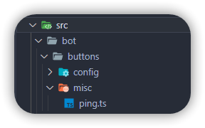

# Working with SWAT's button system!

SWAT uses buttons in a bit of an uncanny way. As seen in the example below, there is a `buttons` folder that contains the `run` function for **every single button** that SWAT uses in its varied functions.



Such is the file structure for the buttons.

## Making a button's `run` function.

Here's a working example of a button that is ran when `/ping` is run and the button is clicked:

```js title="ping.ts"
import { ButtonInteraction, MessageActionRow, MessageButton } from "discord.js";
import Button from "../../../../lib/classes/Button.js";
import BetterClient from "../../../../lib/extensions/BetterClient.js";

export default class Ping extends Button {
    constructor(client: BetterClient) {
        super("ping", client, {
            permissions: ["SEND_MESSAGES"],
            clientPermissions: ["SEND_MESSAGES"],
        });
    }

    override async run(button: ButtonInteraction) {
        return button.reply({ content: "Pong!" });

    }
}
```

Do note however, in the super() constructor, the name **needs to be identical to the custom ID you're setting when creating the button**.

Here's a working example of the button that is attached when `/ping` is run:

```js title="ping.ts"
const button = new MessageActionRow().addComponents(
    new MessageButton().setCustomId("ping").setLabel("Pong!").setStyle("SUCCESS").setEmoji("✅")
)
```

## Disabling Buttons.. fun!

TODO: Add a guide on disabling a singular button.

Disabling ONE action row and all of its inherited buttons. (Just note, you will need multiple buttons programmatically for this to work, however theoretically it should work fine with just the one.)

```ts title="ping.ts"
const disabledButtonRow = await (button.message?.components![0].components.map(button => (button as MessageButton).setDisabled(true))) // This is really and truly spaghetti code, but it works™
const component = new MessageActionRow().addComponents(thingy!) // Simply attach the `disabledButtonRow` to a new action row.
return button.update({ content: "Pong! Notice how these buttons are disabled? Pretty cool!", components: [component] }); // Update the `ButtonInteraction` with the new components, that naturally are disabled.
```

Disabling ALL message action rows and all of their inherited buttons.

